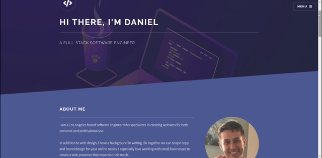

<h1 align="center">Hi 👋, I'm Daniel</h1>
<h3 align="center">A passionate full stack software engineer from Los Angeles, CA</h3>

- 🌱 Ask me about the **MERN Stack!**

- 👨‍💻 For more information, check out my [portfolio!](https://danielshepardson.com/)
  
- 📫Get in touch with me at **dtshepardson@gmail.com**

<h3 align="center">Connect with me:</h3>

  
  
  
  

<h3 align="center">Languages and Tools:</h3>

    
    
    
    
     
    
      
    
    
    

  

<h1 align="center">Projects</h1>
<table bordercolor="#66b2b2">
  
  <tr>
    <td width="50%" valign="top">
      <h3 align="center">NoteWorthy</h3>
         
        
         
        

           
  
  
      

        
<strong>Javascript, CSS, HTML, Node, Express, MongoDB, MVC Architecture</strong> - A task list that allows you to add, remove, and edit items to make the most of your day!

    </td>
    <td width="50%" valign="top">
      <h3 align="center">Star Trek Alien Field Guide</h3>
         
      
         
        

          
  
  
      

        
<strong>Javascript, Node, Express, Heroku, MongoDB</strong> - Modeled after the Star Trek mainframe, learn about all of your favorite aliens with this interactive field guide! ("humans", "vulcans", "klingons", "romulans", "borg", "gorn", and "trill")

    </td>
  </tr>
  
  <tr>
    <td width="50%" valign="top">
      <h3 align="center">DanielShepardson.com</h3>
       
        
       
        

  
  
      

        
<strong>HTML5, CSS3, & Javascript</strong> - Portfolio Site including links to my projects and ways to get in contact with me.

    </td>
    <td width="50%" valign="top">
      <h3 align="center">Ghibli Movie Guide</h3>
         
        
         
        

          
  
  
      

        
<strong>HTML5, CSS3, Javascript, and the Ghibili API</strong> - Type in your favorite Studio Ghibili movie and get the background on it!

    </td>
  </tr>
</table>
